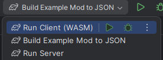
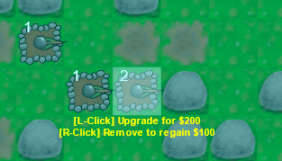

# Towerverse

A browser-based tower defense game with an advanced built-in modding system and server-side game result verification. The goal of this project is to explore the technical details of building an online community-oriented game that can be easily modded and improved continuously by community contributions, so that I can apply the learnings from the project into [Place](https://guncolony.com/2024/06/30/blogplace-1-setting-our-goal/), a multiplayer Minecraft-like FPS game engine that I am actively developing in Kotlin Multiplatform.

Towerverse is a submission to the 2025 Kotlin Multiplatform Contest.

## The Game

In Towerverse, you defend your base from the enemy attack by placing towers. You win by surviving a set number of enemy waves. You will lose if too many enemies manage to reach your base. Towers can also be used to block off enemies and alter their pathfinding. As the waves progress, enemies will level up and gain more health, and you will also need to upgrade your towers in order to survive. Technically, the game is rendering entirely using HTML Canvas and does not use any external game engine, only the DOM API provided by Kotlin/WASM.

However, Towerverse is not just a playable game but also tests two new concepts made possible only through Kotlin and Kotlin Multiplatform, which offer unique features not available in any other mainstream programming language today. The first is a modding system with unprecedented safety and convenience, where modders can develop mods using type-safe Kotlin DSLs that serialize into JSON and can be loaded by the game client and server without security risks. The second is a game result verification system that allows the creation of online scoreboards and social gaming systems immune from tampering by cheaters that submit fake scores. We will explain these features in more detail below, including why they are made possible uniquely by building on top of Kotlin and Kotlin Multiplatform.

## In this repository

In this repository, a basic, playable version of the game is implemented alongside functional, minimal implementations of the aforementioned modding and game verification systems. The codebase is split into the following modules:

* **Client**: the game client written in Kotlin/WASM. It contains a game renderer, as well as logic to send the game results to the server when the player wins the game.
* **Server**: the game verification server using the Ktor framework in Kotlin/JVM. It is able to re-run the game simulation when the client submits its gameplay and therefore determine whether the client's claimed game results are legitimate.
* **Simulation:** a common game simulation module shared by the game client and server. It requires game content from the modding system (Common module) in order to function.
* **Common**: a common module required by the Simulation module as well as the Modding SDK. It defines game object types such as `TowerType`, `GameMap` and `Asset` which can be defined by modders and then used to simulate the game. It also provides helper classes such as `Color` and 2D vectors.
* **ModdingSDK:** a modding SDK that contains types required to write and build mods.
* **OfficialContent:** contains official content that is used by the game. The official content is created in the format of a mod but is loaded differently.
* **ExampleMod:** an example mod project that can be run to compile the mod into a JSON file. This mod can then be loaded in the game to provide additional game features.

## How to run the game

### IntelliJ IDEA

The project contains some built-in IntelliJ IDEA Run Configuration files which will appear when loading the project in the IDE.

Click "Run Client (WASM)" to launch the game. It will open in a new browser window. See below for a guide to play the game and reach the win screen, since winning the game is what triggers the result upload process to the server.

Click "Run Server" to launch the game result verification server. The server will launch on port 8079. Go to [http://localhost:8079](http://localhost:8079) to view the current scoreboard on the server. This server must be online when you win the game on the client. To test the project it is recommended to have the client and server running simultanously.

Click "Build Example Mod to JSON" to generate a JSON from the ExampleMod. (Note that the pre-built JSON is also already included in this Git repository.)

### Manual

From the project root folder, run the "Client:wasmJsBrowserRun" Gradle task to launch the game client.

To launch the game server, after building the root project, from the Server module folder, run the "yz.cool.towerverse.server.MainKt" JVM class.

To generate the Example Mod JSON, after building the root project, from the ExampleMod module folder, run the "ExampleModKt" JVM class.

## How to load mods

You can load the ExampleMod's JSON or your own mod into the game by clicking the "[Add Mod]" button:

After loading the mod, the game will reset, and you should notice that a much larger game board has been loaded, and a new tower has appeared which is available to place. Note that currently you should not load the same mod twice, or it may cause some data inconsistencies that cause the game to fail to verify with the game server afterwards.

## How to play the game

The vanilla game content is quite easy to win as long as you spend all your in-game money on placing and upgrading towers. It is also designed to be short with only 5 waves to allow you to reach the win screen quickly to test the game verification system.

Left click anywhere on the map to select a tile, and click again to place a tower:

Select a tower and click again to upgrade it:

Use the bottom bar to select the type of tower you want to place:

Placing a tower will block off the enemy's pathfinding, but the game does prevent you from fully blocking off the enemies' path. Try to force enemies to go a longer path to reduce the chances of them getting through. Finally, the amount of score you earn depends on how fast you kill enemies. Try to beat my top score of ~1300 in the vanilla game!

To speed up the game and wait less time before , click the game speed button on the bottom right (a flashing label will display before the game starts to let you know that it's there):

## Visual Appearance

Screenshot of Towerverse's UI (taken with the ExampleMod installed):

The visual appearance of Towerver is intended to feel like a remake of an old Java tower defense game I developed in high school:

However, Towerverse improves upon the old game in several areas such as better interpolation of enemy movement and rendering of particles. In addition, Towerverse is available to play in the browser.

## Result verification

After winning the game, you will be prompted whether to send your game result to the game server for verification. If you click yes, you will be prompted to enter your name, then if the verification is successful you will get the ability to view the results. (Note: the screenshot below is outdated)

The result verification system works by the game server being able to re-run the entire game simulation in the exact same way as the client. As the client plays the game, its actions such as placing, upgrading, and destroying a tower are recorded and can be replayed during the server's game simulation. At the end of the game, the entire game state is serialized into JSON through Kotlin Serialization and its hash is computed. The server will only accept the result if the game state hashes between the client and server are identical.

This verification system works because thanks to Kotlin Multiplatform, the simulation can be kept entirely consistent (including random number generation) between the server running on JVM and the client running on WASM in the browser. This allows us to leverage the performance and multi-threaded nature of the JVM when verifying game results, while still benefitting from the unique integration with the DOM API offered by Kotlin/WASM that allows us to build this project in two weeks.

## Leaderboard

The leaderboard and a list of all verified game results is displayed when visiting the game server at [localhost:8079](http://localhost:8079). The leaderboard will only show games that have been played without any mods. However, the server is able to verify modded matches and display their results in a separate game results list (as the client includes its mod JSONs when sending its match data to the server to be verified). Currently there is no persistence for the data so it will reset after restarting the server.

## Modding

Modding is done through the Kotlin DSL format. Mods in Towerverse are Kotlin code projects that use the Modding SDK as a dependency. The Kotlin DSL uses some advanced Kotlin features such as delegates in ways that are inspired by other DSLs such as the Gradle DSL for Kotlin Multiplatform.

The benefits of Kotlin DSL when it comes to the modding system are immense, and Kotlin is the only language that offers the capability. Kotlin DSLs offer type safety to modders, and in addition we support type-safe cross-references between game objects that work by serializing the references into the referenced game object IDs. In addition, one can benefit from the features of IntelliJ IDEA when modding the game that are simply not present in traditional modding systems that rely on YAML and text files, such as the ability to refactor a game object's name and change all other references that point toward it:

For a list of all game objects supported, check the README file in the `Common` module: [README](Common/README.md)

## In-development screenshots

Some in-development screenshots:

